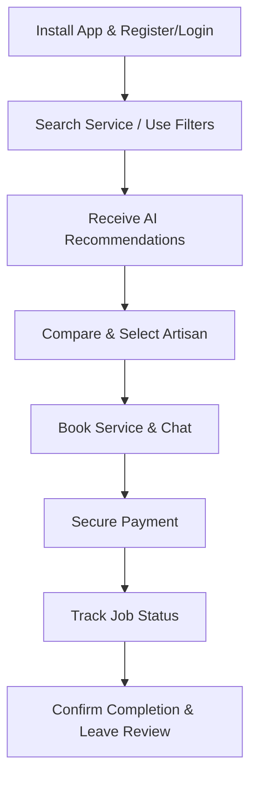
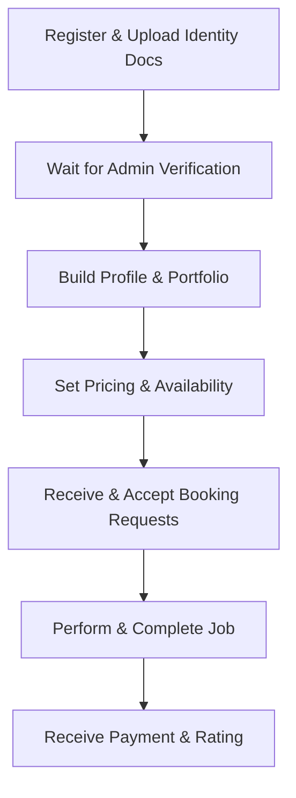

<<<<<<< HEAD
# AI-Based Platform Connecting Customers and Artisans

> An intelligent, secure, and user-friendly service marketplace that connects customers with verified artisans and skilled professionals using Artificial Intelligence.

---

## 📋 Table of Contents

- [Project Overview](#-project-overview)
- [Objectives & Vision](#-objectives--vision)
- [Main Users](#-main-users)
- [User Journeys](#-user-journeys)
- [Artificial Intelligence Features](#-artificial-intelligence-features)
- [Main Modules](#-main-modules)
- [Technology Stack](#-technology-stack)
- [Expected Outcome](#-expected-outcome)

---

## 📌 Project Overview

This project is an **AI-powered service marketplace** designed to connect customers with verified artisans and skilled professionals via a secure, intelligent web and mobile application. Unlike traditional directories or classified ads websites, the platform analyzes customer service requests using Artificial Intelligence to recommend the most suitable professionals based on location, skills, ratings, availability, budget, and work history.

### Supported Professions & Services
The platform supports a broad spectrum of skilled workers, technicians, and freelancers, including:
- **Trades & Crafts**: Plumbers, Electricians, Carpenters, Painters, Welders, Mechanics, Tailors
- **Home & Appliance Repair**: AC Technicians, Home Appliance Technicians, Computer & Mobile Phone Repair Technicians
- **Personal & Domestic Care**: Hairdressers, Beauticians, House Cleaners, Babysitters, Gardeners, Tutors
- **Creative & Technical Services**: Photographers, Graphic Designers, Software Developers, Network Engineers, Interior Designers, Event Decorators, Security Guards, and other skilled professionals.

---

## 🎯 Objectives & Vision

- **Intelligent Matching**: Eliminate manual searching across hundreds of profiles by utilizing AI algorithms to match requirements with provider capabilities.
- **Verification & Trust**: Build a trusted ecosystem through official identity document verification and authentic community reviews.
- **Economic Empowerment**: Provide skilled workers and freelancers with increased visibility, client management tools, and employment opportunities.
- **Seamless Experience**: Offer end-to-end service booking, secure messaging, real-time tracking, and hassle-free payment management.

---

## 👥 Main Users

### 1. Customer
A customer is anyone seeking professional services.
- **Features**: Account creation, natural language search, category browsing, multi-criteria filtering (location, price, rating, experience, availability, verification status), viewing portfolios (photos/videos), reading reviews, receiving AI recommendations, direct chat, secure booking & payments, live status tracking, rating & reviewing completed jobs, reporting fraud.

### 2. Artisan (Professional)
A verified skilled professional providing services.
- **Features**: Registration, identity verification (official document upload), professional profile management, service catalog setup & pricing, availability scheduling, portfolio showcase, receiving/accepting/rejecting booking requests, real-time client chat, work progress updates, job completion confirmation, earnings dashboard, receiving AI profile optimization tips.

### 3. Administrator
The platform manager overseeing system health and operations.
- **Features**: User management, artisan identity & document verification (approve/reject), removing fake accounts, managing service categories, review moderation, complaint handling, AI recommendation model configuration, analytics & reporting, payment records monitoring, platform announcements.

---

## 🗺️ User Journeys

### Customer Journey


### Artisan Journey


---

## 🤖 Artificial Intelligence Features

Artificial Intelligence serves as the primary engine for platform efficiency and security:

1. **Smart Recommendation System**: Ranks and suggests artisans by computing relevance scores based on customer location, service category, provider rating, completed job history, response speed, schedule availability, years of experience, and verification status.
2. **Intelligent Search (NLP)**: Processes natural language queries (e.g., *"I need someone to repair my leaking sink"*) and maps them accurately to appropriate service categories and providers.
3. **AI Chat Assistant**: An interactive helper for finding services, guiding booking flows, answering FAQs, and assisting with preliminary troubleshooting.
4. **Fraud Detection**: Continuously scans platform activity to detect duplicate accounts, fake reviews, spam messages, abnormal booking behaviors, suspicious transactions, and plagiarized portfolio media.
5. **Personalized Home Page**: Adapts each customer's interface according to booking history, preferred service categories, location, budget constraints, and frequent searches.
6. **AI Profile Improvement**: Evaluates artisan profile completeness and offers automated suggestions (e.g., uploading more portfolio pictures, improving response times, adjusting service descriptions).

---

## 🧩 Main Modules

| Module | Key Functions |
| :--- | :--- |
| **Authentication** | Registration, Login, Password Reset, Email Verification, JWT Role Management (Customer, Artisan, Admin) |
| **Profile** | User details, contact info, skills, experience, portfolio gallery, ratings, verification badges |
| **Service Management** | Add/edit/remove services, pricing configurations, working location radiuses, schedule management |
| **Booking** | Service request creation, cancellation, status tracking (`Pending`, `Accepted`, `Rejected`, `In Progress`, `Completed`, `Cancelled`) |
| **Messaging** | Real-time chat powered by Socket.IO with text and image attachment support |
| **Payment** | Secure online transactions, invoice records, payout tracking for artisans |
| **Review** | Post-job ratings and written feedback feeding directly into AI recommendation weights |
| **Notification** | Push notifications for bookings, messages, payments, verification updates, and promotions |
| **Administration** | Admin dashboard for user oversight, document verification queues, complaints, AI settings, and platform analytics |

---

## 🛠️ Technology Stack

```
                     ┌────────────────────────────────┐
                     │     Flutter Mobile App UI      │
                     └───────────────┬────────────────┘
                                     │ REST API / Socket.IO
                     ┌───────────────▼────────────────┐
                     │       Express.js Backend       │
                     └───────┬────────────────┬───────┘
                             │                │
             ┌───────────────▼──────┐  ┌──────▼─────────────────────┐
             │ Sequelize ORM + PG   │  │ Python AI Microservices    │
             │     (Database)       │  │ (Recommendations & NLP)   │
             └──────────────────────┘  └────────────────────────────┘
```

- **Frontend**: Flutter (Cross-platform Mobile UI)
- **Backend API**: Express.js (Node.js framework)
- **Database & ORM**: PostgreSQL with Sequelize ORM
- **Real-Time Communication**: Socket.IO
- **Authentication**: JSON Web Tokens (JWT) & bcrypt encryption
- **AI Microservices**: Python-based Machine Learning models integrated via HTTP/gRPC APIs
- **Storage**: Cloudinary (Media assets & document uploads)
- **Push Notifications**: Firebase Cloud Messaging (FCM)

---

## 🏆 Expected Outcome

A robust, scalable, and secure AI-driven platform that streamlines how customers discover, evaluate, and hire trustworthy artisans, while empowering skilled professionals with tools to manage and scale their services efficiently.
=======
# Skillora
>>>>>>> b488c75b00df24062759f8f036fda3b567376cfe
