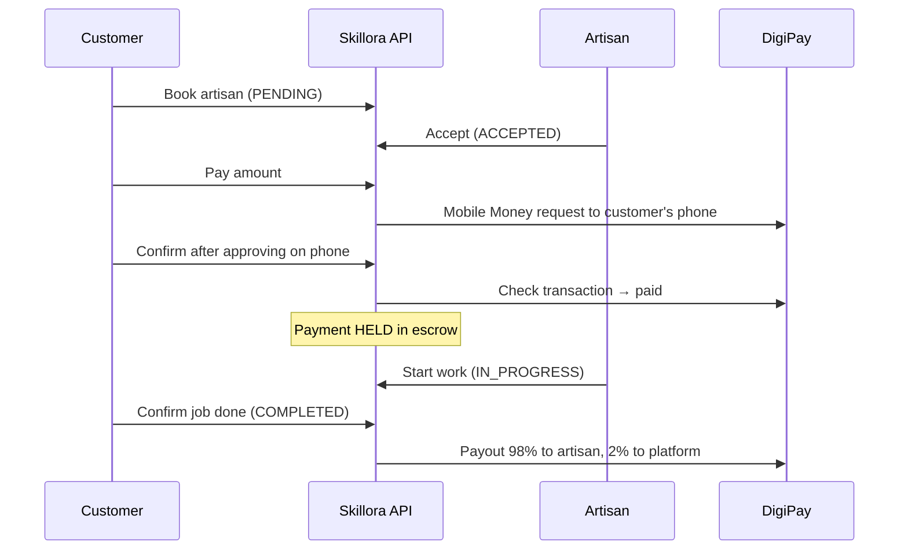

# Skillora

> A marketplace that connects customers in Cameroon with skilled artisans: plumbers, electricians, carpenters, technicians and more. Artisans can earn a **Verified Badge** by passing an AI-generated trade quiz, and customers pay through **Mobile Money into escrow**, released only when they confirm the job is done.

---

## Contents

- [Features](#features)
- [How a job works](#how-a-job-works)
- [Technology stack](#technology-stack)
- [Project structure](#project-structure)
- [Getting started](#getting-started)
- [Configuration](#configuration)
- [Testing](#testing)
- [Security model](#security-model)
- [Roadmap](#roadmap)

---

## Features

### Customers
- Browse and search artisans by trade, city or skill; filter by verified, solo or workshop
- Send a booking request with a description, address and preferred date
- Pay by MTN MoMo / Orange Money into **escrow**; the money is released to the artisan only after the customer confirms the work is done
- Track each job (Requested → Accepted → Paid → In progress → Completed), download a receipt
- Leave a review, only after a completed job and once per job
- Save favourite artisans; receive in-app notifications

### Artisans (solo or workshop)
- Sign up in 4 steps: account → trade & presentation video → 10-question AI quiz → ID / selfie / certificate
- Or skip verification and start working immediately without the badge
- Accept or decline requests, start jobs, and get paid automatically on the customer's confirmation (minus a 2% platform fee)
- Manage cover photo, portfolio, bio, service area and location privacy (exact / approximate / city only)

### Administrators
- Admin console: statistics, users, artisans, verification queue, services, requests, reviews, categories, broadcast notifications
- Admin accounts cannot be created through public sign-up (see [Creating an admin](#creating-an-admin))

### AI
- Trade quiz generation (with offline question banks when the AI is unavailable)
- Written-answer evaluation, document consistency analysis, search-intent extraction
- Chat assistant and recommendation scoring (relevance, distance, rating, verification, experience, availability)

---

## How a job works



If a paid job is cancelled or rejected, the payment is flagged `REFUND_PENDING` for an administrator.

---

## Technology stack

| Layer | Technology |
| :--- | :--- |
| Web app | React 19, Vite, Tailwind CSS (`frontend/Marketplace`) |
| API | Node.js, Express 5 (`backend`) |
| Database | MongoDB with Mongoose |
| Auth | JWT + bcrypt |
| Payments | DigiPay SDK (MTN MoMo / Orange Money) |
| AI | OpenRouter API (optional; offline fallbacks built in) |
| File storage | Local `backend/uploads` folder |

`frontend/agrimed_link` is a separate Flutter prototype and is not connected to this API.

---

## Project structure

```
backend/
  src/
    config/        MongoDB connection
    controllers/   Route handlers (auth, professionals, requests, payments, verifications, admin, ...)
    middleware/    Auth, admin auth, roles, uploads, error handler
    models/        Mongoose schemas
    routes/        Express routers mounted under /api
    services/      AI, DigiPay, escrow payouts, recommendations, trust levels
    utils/         JWT, ownership checks, distance
    scripts/       admin.js (create / list / disable administrators)
    seeders/       Demo data
  tests/           End-to-end API tests
frontend/Marketplace/
  src/api.js       Shared API client + data mappers
  src/components/  Screens and dialogs
```

---

## Getting started

Requirements: Node.js 20+, MongoDB 6+.

```bash
# 1. API
cd backend
npm install
cp .env.example .env        # then fill in JWT_SECRET (required) and the other values
npm run dev                 # http://localhost:5000

# 2. Web app (second terminal)
cd frontend/Marketplace
npm install
npm run dev                 # http://localhost:5173 (proxies /api to :5000)
```

Optional demo data: `cd backend && npm run seed`.

### Administrators

Admins can only be created from the server, never from the website:

```bash
cd backend
npm run admin -- create --email you@your-domain.cm --first Juan --last Mengue   # password typed at a hidden prompt
npm run admin -- list
npm run admin -- password --email you@your-domain.cm
npm run admin -- disable --email old-admin@your-domain.cm
```

Passwords need 12+ characters with upper and lower case, a digit and a symbol. Admins sign in from **Footer → Administration**; the public login refuses admin accounts. The demo seeder never creates admins and refuses to run in production.

---

## Configuration

All settings live in `backend/.env` (see `backend/.env.example`):

| Variable | Required | Purpose |
| :--- | :---: | :--- |
| `JWT_SECRET` | ✅ | Signs login tokens. The server refuses to start without it. |
| `MONGO_URI` | ✅ | MongoDB connection string |
| `CORS_ORIGINS` | | Allowed web origins (default `http://localhost:5173`) |
| `OPENROUTER_API_KEY` | | Enables live AI; otherwise offline fallbacks are used |
| `DIGIPAY_API_KEY` | for payments | DigiPay API key (`dpk_...`) |
| `DIGIPAY_ENV` | | `production` or `sandbox` |
| `DIGIPAY_MOCK` | | `true` = fake payments for local development (refused in production) |
| `PLATFORM_ORANGE_NUMBER` | | Receives the platform commission payout |
| `PLATFORM_FEE_PERCENT` | | Platform fee, default `2` |

Never commit `.env` files or API keys. Keys belong only in the backend `.env`; the web app never needs one.

---

## Testing

The end-to-end suite checks the security rules and the full booking → escrow → payout → review flow. **Run it against a test database**, because it creates accounts:

```bash
cd backend
MONGO_URI=mongodb://127.0.0.1:27017/skillora_test DIGIPAY_MOCK=true npm start
# in another terminal
npm run test:e2e
```

---

## Security model

- Public sign-up can only create `CUSTOMER` or `PROFESSIONAL` accounts; admins are created with `npm run admin` and must use the admin portal.
- Login, admin login, sign-up and password reset are rate-limited. Admin sessions expire after 2 hours, and every admin sign-in attempt is written to the server log (`[ADMIN AUTH]`).
- Search inputs are escaped before reaching the database.
- Passwords and reset codes are never returned by the API. Reset codes are hashed, expire after 15 minutes and allow 5 attempts. *Delivery by email/SMS still has to be connected; in development the code is printed in the server console.*
- Every write route checks ownership: users can only act on their own profile, requests, payments, verifications and reviews; admins can act on everything.
- The quiz answers are stored server-side; the browser never receives them.
- Uploads require login, accept images (JPEG/PNG/WEBP/GIF) and videos (WEBM/MP4/MOV) only, and are served with `nosniff` and a restrictive CSP.
- Payments move `PENDING → HELD → PROCESSING → SUCCESS` with atomic transitions, so a payment can never be released twice.

---

## Roadmap

- Email/SMS delivery of password-reset codes
- DigiPay webhooks (automatic payment confirmation instead of the "I approved" button)
- Real-time chat (Socket.IO) and push notifications
- Cloud storage for uploads (e.g. Cloudinary / S3)
- URL routing in the web app
